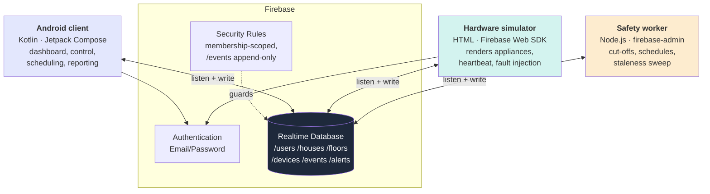
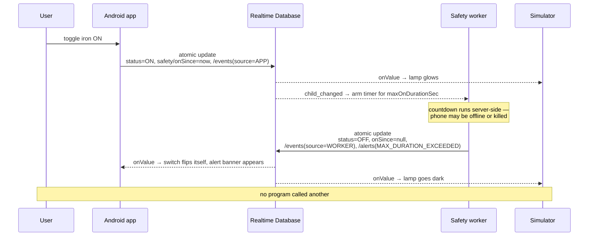

# Smart Home Monitoring & Control System — Technical Report

**SCS 3311 — Mobile Application Design & Development Mini-Project**

| | |
|---|---|
| Repository | https://github.com/adithaanusara/SmartHomeMonitoringSystem |
| Release | v1.2 — `SmartHomeApp-v1.2.apk`, 2.57 MB, `versionCode 3` |
| Firebase project | `smarthomeapp-c60d9-77331` (Realtime Database, `asia-southeast1`) |

This report covers the three topics named in the specification: the **synchronisation mechanism**,
the **floor representation**, and the **simulator operations**. The data model they all share is
described first, because each of the three depends on it.

---

## 1. System overview

The system is three independent programs that share one Firebase Realtime Database and never call
each other. All state moves through database listeners. That indirection is not incidental — it is
what makes the synchronisation bidirectional, and it is why the mobile client needs no polling and
no refresh control.



**Why Realtime Database rather than Firestore.** The listener model *is* the requirement. `onValue`
fires on any change regardless of which of the three programs caused it, the web simulator
subscribes in three lines of JavaScript with no query planning, and `firebase-admin` gives the
worker the identical model server-side. Firestore's query engine would have added cost without
serving anything the specification asks for.

**Why a worker process rather than Cloud Functions.** The specification explicitly permits "a
backend cloud listener **or a worker process**". Cloud Functions now requires the Blaze billing
plan; a plain Node process satisfies the wording, carries no billing risk, and is far easier to put
on screen during the demo.

---

## 2. Data model

The full schema and its invariants are in [`SCHEMA.md`](SCHEMA.md). Summarised:

```
/users/{uid}                     displayName, email, houses: { {houseId}: true }
/houses/{houseId}                name, ownerUid, members: { {uid}: "owner" | "member" }
/floors/{houseId}/{floorId}      name, level, planImageAsset, gridCols, gridRows,
                                 rooms: { {roomId}: { name, x, y, width, height } }
/devices/{houseId}/{deviceId}    floorId, name, type, gridX, gridY, status, lastSeen,
                                 channels{}, safety{}, schedule{}, camera{}
/events/{houseId}/{deviceId}/{k} ts, from, to, source, actorUid
/alerts/{houseId}/{k}            ts, deviceId, kind, message, acknowledged
```

The tree is flat and denormalised by `houseId` so each screen needs one listener per node rather
than a join. Four decisions in it matter for the sections below:

1. **`status` is one enum across all five device types** (`ON` / `OFF` / `ERROR` / `DISCONNECTED`).
   A multi-switch unit's own status is rolled up from its channels — any channel `ON` makes the
   unit `ON` — so a single status component serves every device.
2. **Enum-valued fields are stored as strings, not Kotlin enums.** The Firebase mapper throws on an
   unrecognised constant, and two of the three writers are untyped JavaScript. They are read
   through `deviceType` / `effectiveStatus`, which fall back rather than crash the screen.
3. **`/events` is append-only** and is the sole source for the usage report. Totals are derived by
   folding state transitions rather than maintaining a counter, which would drift whenever a
   client died mid-session.
4. **Every writer stamps its own `source`** (`APP`, `SIMULATOR`, `WORKER`, `SCHEDULE`). This is
   what lets the report tell a user's toggle apart from an automatic safety cut-off.

Security rules enforce that nothing is readable while signed out, that `/floors`, `/devices`,
`/events` and `/alerts` are restricted to members of that house, that `status` and `type` match the
schema's enums, and that existing `/events` entries cannot be edited or deleted.

---

## 3. Synchronisation mechanism

### 3.1 Reading — listeners bridged to Flows

Every read path is a Firebase `ValueEventListener` bridged into a Kotlin `Flow`:

```kotlin
fun DatabaseReference.valueEvents(): Flow<DataSnapshot> = callbackFlow {
    val listener = object : ValueEventListener {
        override fun onDataChange(snapshot: DataSnapshot) { trySend(snapshot) }
        override fun onCancelled(error: DatabaseError) { close(error.toException()) }
    }
    addValueEventListener(listener)
    awaitClose { removeEventListener(listener) }
}
```

`callbackFlow` rather than a plain `flow {}` because the listener is a callback that must be
unregistered; `awaitClose` is what guarantees that, and omitting it leaks the listener for the
lifetime of the process.

The listener fires on **any** change to its node, whoever caused it. That single property delivers
the specification's requirement that "state updates driven externally must quickly update the
mobile viewport without manual refresh triggers" — there is no refresh control in the app because
there is nothing for it to do.

State is composed once, in a **single house-scoped `HomeViewModel`** shared by the dashboard, floor,
device and schedule screens. One ViewModel rather than one per screen: all of them render slices of
the same `/devices` node, so separate ViewModels would open duplicate listeners against identical
paths and could briefly disagree with each other mid-update.

### 3.2 Writing — atomic multi-path updates

A device toggle is never a single `setValue`. It is one `updateChildren` carrying every path the
action touches:

```kotlin
val updates = mutableMapOf<String, Any?>("$basePath/status" to newStatus.name)

if (device.deviceType == DeviceType.HAZARD) {
    updates["$basePath/safety/onSince"] =
        if (newStatus == DeviceStatus.ON) db.serverTimestamp() else null
}
if (device.deviceType == DeviceType.MULTI_SWITCH && newStatus != DeviceStatus.ON) {
    device.channels.keys.forEach { updates["$basePath/channels/$it/status"] = newStatus.name }
}
updates += eventUpdate(houseId, device.id, from, to, actorUid)

db.applyAtomicUpdate(updates)          // one updateChildren, all-or-nothing
```

This matters most for hazard devices. A partial write would leave an iron `ON` with no `onSince` —
precisely the state the safety worker cannot protect against, because `onSince` is what it arms its
timer from. Making status, safety bookkeeping and the audit event one atomic unit means no observer
can ever see that combination.

Timestamps use Firebase's **server timestamp sentinel** rather than the device clock, so event
ordering does not depend on phones and laptops agreeing on the time.

### 3.3 End-to-end: the server-side safety cut-off

The clearest demonstration of the whole mechanism is the cut-off, because it crosses all three
programs without any of them addressing each other:



The countdown is authoritative **only** on the worker. The app shows a live countdown on the hazard
device screen, but it is display-only — the phone may be offline, backgrounded or killed at the
moment the limit is reached, none of which should leave an iron powered on.

Restart safety comes free from the listener model: Firebase replays `child_added` for every existing
device when the worker attaches, so a worker that restarts mid-countdown re-arms from the persisted
`onSince` rather than losing the timer. Without that, a crash would silently disable the protection.

**Verified live** against the project database. Worker log:

```
09:35:02  INFO   safety   armed Laundry Iron — cutoff in 11s (limit 12s)
09:35:13  ALERT  safety   CUTOFF  Laundry Iron exceeded 12s — forced OFF and alert raised
```

Resulting database rows:

```
/events  ON -> OFF   source=WORKER
/alerts  MAX_DURATION_EXCEEDED  "Laundry Iron was switched off automatically after 12s."
```

The reverse direction was verified the same way: toggling a device in the app wrote
`status: ON → OFF` with an `/events` entry carrying `source: APP` and the acting user's `actorUid`.

---

## 4. Floor representation

### 4.1 Two layers, not two alternatives

A floor is drawn as three stacked layers:

```
   ┌─────────────────────────────────────────┐
   │  3. device markers   gridX / gridY      │   status-coloured, tappable
   │  2. grid overlay     gridCols × gridRows│   the spec's abstract mapping
   │  1. plan image       planImageAsset     │   bundled drawable, optional
   └─────────────────────────────────────────┘
```

**Layer 1 — the plan image.** `planImageAsset` holds a *drawable resource name*, not a URL. Plans
ship inside the APK and are resolved through an explicit `Map<String, Int>` rather than
`Resources.getIdentifier`: reflection by name is slow, invisible to R8 (the drawables would need
keep rules to survive shrinking), and fails at runtime rather than at compile time when a plan is
renamed. Firebase Storage was rejected deliberately — it would add an upload flow and a second set
of security rules for no marks. The specification explicitly permits free sample plans.

**Layer 2 — the abstract grid.** The overlay is sized from the floor's own `gridCols`/`gridRows`,
not from the image. The card takes `aspectRatio(cols / rows)`, so a cell is always square and a
device lands in the same relative place at every screen size. Sizing from the drawable instead
would make placement depend on the image's intrinsic dimensions, and markers would drift whenever
a plan was swapped.

**Layer 3 — device markers.** Each device carries integer `gridX`/`gridY` and is drawn at that cell,
tinted by status with a ring when `ON`.

### 4.2 User-drawn rooms

Floors can also be drawn by hand in the floor plan editor: drag on the canvas to create a room, name
it, undo or clear, then save. Rooms render as a layer over the plan image, so a floor can have a
bundled plan, hand-drawn rooms, both, or neither.

**Room geometry is stored as fractions of the plan area, 0..1 — never pixels.** This is the single
most important decision in this section. The editor canvas, the dashboard thumbnail and the floor
screen are three different sizes, and every phone is a fourth; pixel coordinates would place a room
somewhere different on each. Fractions also put rooms in the same coordinate space as `gridX`/
`gridY`: a device in cell (x, y) falls inside a room when `x / gridCols` lies within the room's
horizontal span. The editor canvas uses the same `aspectRatio(cols / rows)` as the floor screen, so
a square drawn in the editor arrives as a square on the dashboard.

Rooms are a **keyed map, not a list**. Firebase stores a list as an array, so deleting any room but
the last leaves a null hole that every reader then has to skip. The map key is the room id.

### 4.3 Defensive parsing

`Floor.rooms` is excluded from the Firebase object mapper and parsed separately by the repository.
The mapper aborts the *entire* object when one field does not match its declared type, and
`observeChildren` skips children that fail to deserialise — so one malformed room would take the
whole floor **and its devices** off the dashboard, with no error anywhere. This was not theoretical:
rooms written by an earlier build, in the old pixel format, did exactly that. Parsing rooms
individually and discarding any whose geometry falls outside 0..1 degrades that failure to "the
floor renders, the bad room does not". Eight unit tests pin the behaviour.

---

## 5. Simulator operations

The simulator is a static HTML page using the Firebase Web SDK as ES modules from a CDN — no build
step, no bundler. It stands in for the physical appliances: it subscribes to the same
`/devices/{houseId}` and `/floors/{houseId}` nodes as the app and *renders* what the database says,
grouped by floor, with per-channel LEDs on gang boxes and camera snapshot tiles.

It signs in with a **dedicated simulator account** rather than anonymously, so one membership model
covers all three programs and the same security rules apply to it as to the app.

### 5.1 Heartbeat — making `DISCONNECTED` real

Every ~10 seconds the simulator writes `lastSeen` for every device it represents, as **one
multi-path update** rather than one write per device — a single round trip instead of ten.

The worker sweeps every 10s and marks anything unseen for more than 30s (two missed beats)
`DISCONNECTED`, appending an event and an alert. This is what turns `DISCONNECTED` from a
decorative enum value into a state the system actually produces.

**The worker never clears `DISCONNECTED`.** Recovery belongs to the device: the simulator
republishes its own status when it reconnects, because only it knows whether the appliance came
back on or off. Guessing on the server would let the dashboard show a lamp as `OFF` while it is
physically lit.

Observed live — with the simulator stopped, the worker correctly swept all ten devices:

```
09:34:42  WARN  heartbeat  Laundry Iron unreachable for 124224s -> DISCONNECTED
```

### 5.2 Fault injection

Per-device operator controls exist purely to drive the demo, each exercising a different path:

| Control | Writes | Exercises |
|---|---|---|
| **Switch on / Switch off** | `status` + `/events` with `source: SIMULATOR` | Externally-originated change appearing in the app without a refresh |
| **Fault / Clear fault** | `status: ERROR`, and back again | The `ERROR` state and the app's fault notice |
| **Cut beat** | stops writing `lastSeen` for that device | The worker's staleness sweep → `DISCONNECTED` |

"Cut beat" is the useful one for a demo: it makes the worker do something visible within 30 seconds
without waiting for a real network failure. Restoring the beat resumes `lastSeen` writes, and the
simulator republishes the device's true status — the recovery path described above.

The simulator also renders a live countdown to the worker's cut-off on hazard devices, so all three
programs can be shown agreeing on the same deadline from three different sources.

### 5.3 The three-way demonstration

The bidirectional requirement is only fully visible with all three running at once:

1. Toggle in the app → the simulator's lamp lights immediately (`APP` → database → simulator).
2. Switch from the simulator → the app's control flips itself (`SIMULATOR` → database → app).
3. Set a short max-on-duration on the iron and leave it on → the worker forces it off, the app's
   switch moves on its own and an alert banner appears, and the simulator's lamp goes dark
   (`WORKER` → database → both clients).

No program addresses another in any of the three.

---

## 6. Verification

| Area | Evidence |
|---|---|
| Usage-report arithmetic | 13 JVM tests — partial overlaps, still-on intervals, out-of-order events, worker vs manual switch-offs |
| Duration formatting | 3 JVM tests — rounding, so per-device rows sum to their total |
| Floor / room deserialisation | 8 JVM tests against the real Firebase mapper — legacy array data, missing node, geometry bounds |
| Schedule window logic | 16 Node tests — day filtering, overnight windows, boundary collisions, malformed input |
| Safety cut-off | Verified live against the project database (§3.3) |
| Heartbeat → `DISCONNECTED` | Verified live (§5.1) |
| App write path | Verified live — UI toggle produced `source: APP` with the correct `actorUid` |
| Release build | R8-shrunk to 2.57 MB; model classes held by keep rules and confirmed present in R8's seed output |
| Device run | Installed and driven end-to-end on a Pixel 6 emulator, light and dark themes, no crashes |

**Total: 41 automated tests, all passing** (25 JVM, 16 Node).

The two pieces of logic most likely to be wrong and least likely to be noticed are covered
deliberately: deriving on-durations from a transition log, and deciding when a schedule boundary
fires.

---

## 7. Design decisions worth defending

| Decision | Reasoning |
|---|---|
| Realtime Database over Firestore | Listener fan-out is the requirement; the simulator subscribes in three lines |
| Node worker over Cloud Functions | Explicitly permitted; avoids the Blaze billing requirement entirely |
| Enums stored as strings | The mapper throws on unknown constants and two of three writers are untyped JS |
| Atomic multi-path writes | A partial write leaves a hazard device `ON` with no `onSince` |
| Server timestamps | Ordering must not depend on client clocks |
| `/events` as the report source | A running counter drifts whenever a client dies mid-session |
| One house-scoped ViewModel | Avoids duplicate listeners on identical paths and mid-update disagreement |
| Room geometry as 0..1 fractions | The same numbers render correctly at four different sizes |
| Rooms as a keyed map | A Firebase array leaves null holes on deletion |
| Fixed palette, no dynamic colour | Status legibility must not depend on the user's wallpaper |
| Status colours outside the Material scheme | `ON` must stay green and `ERROR` red on every device |
| Status carried by text as well as colour | Readable for colour-blind users and in a greyscale recording |

---

## 8. Team contributions

A two-member group. Each row is traceable to that member's own commits under their own Git
identity, which is the evidence individual defence rests on.

| Member | Owned | Report section |
|---|---|---|
| **T.H. Ellewela** | Data layer, Firebase services and schema, authentication and navigation, dashboard, device profile UIs, scheduling, usage reporting, safety worker, web simulator, release engineering and UI design system | §3 Synchronisation mechanism<br/>§5 Simulator operations |
| **Aditha Anusara** | Android project scaffold and module structure, initial Firebase integration, build/toolchain configuration, floor plan editor — manual room drawing, naming, undo/clear and persistence | §4 Floor representation |

Git identities: `thisunhansaja@gmail.com` (T.H. Ellewela) and `adithaanusara31@gmail.com`
(Aditha Anusara).

---

## Appendix — running the system

```bash
# 1. Firebase — see firebase/README.md
#    create the Realtime Database, enable Email/Password,
#    publish firebase/database.rules.json, import firebase/seed-data.json

# 2. Android
./gradlew assembleDebug

# 3. Simulator (serve over localhost, not file://)
npx serve simulator

# 4. Worker
cd worker && npm install
cp .env.example .env          # set FIREBASE_DATABASE_URL
# add service-account.json from the Firebase console
npm start

# Tests
./gradlew testDebugUnitTest   # 25
cd worker && npm test         # 16
```

For the demo, **start the simulator before the app** — without its heartbeat the worker correctly
marks every device `DISCONNECTED` after 30 seconds.
